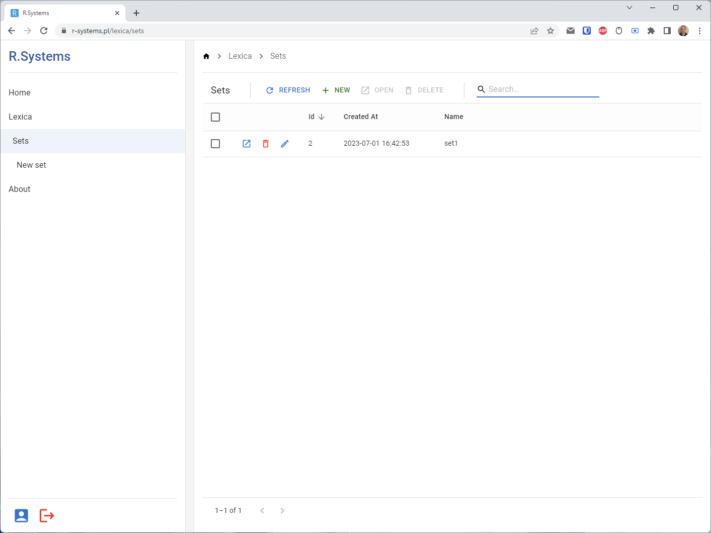
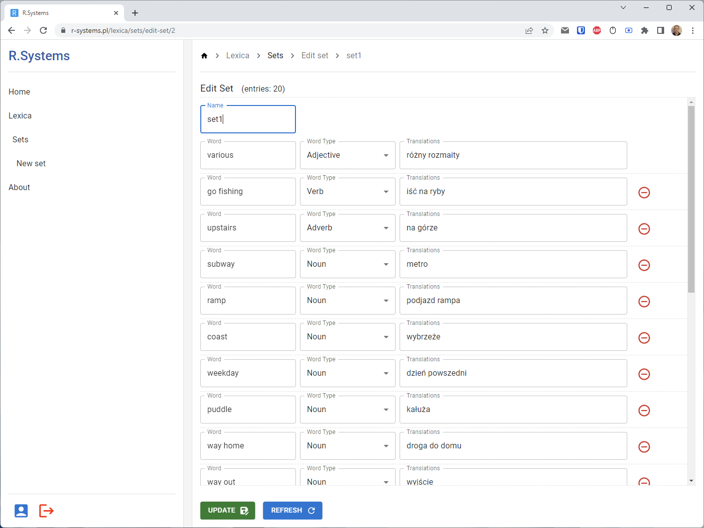
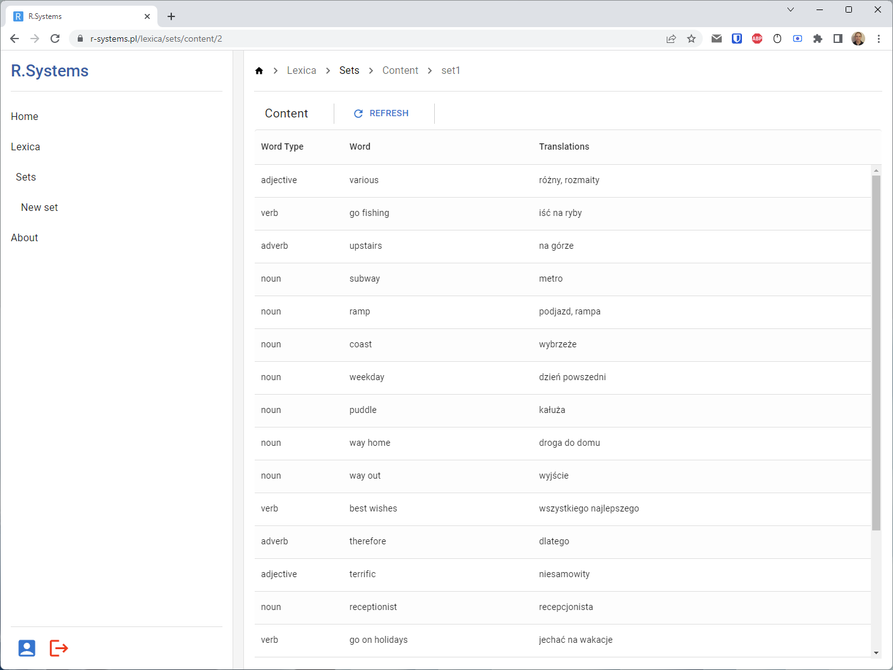
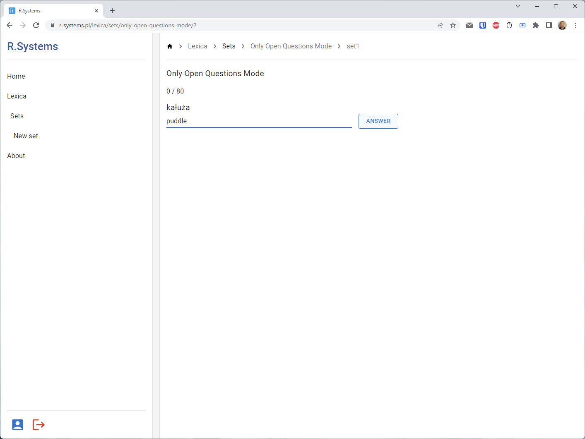
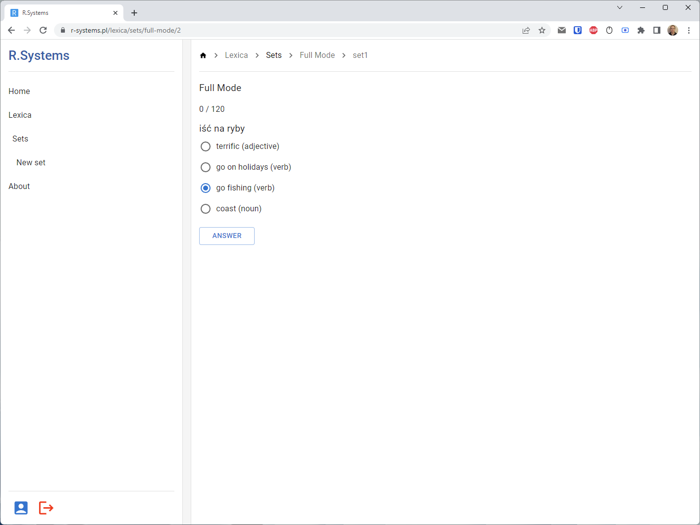
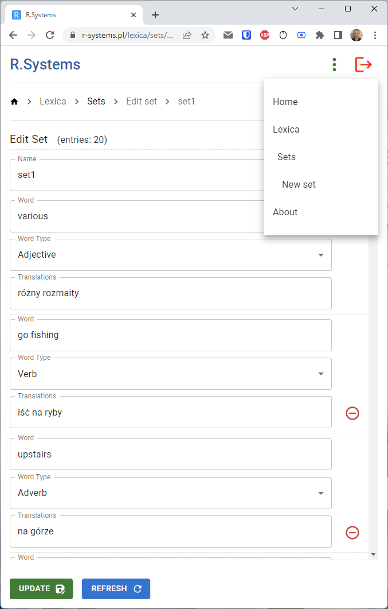

# r-systems-react-front

React SPA (React 18 + Vite 4) acting as the web frontend for my different ideas connected with creating software.

Currently it contains one module called Lexica. Lexica is the English vocabulary learning software.

Back-end of this module: <https://github.com/lrydzkowski/R.Systems.Lexica>

## Video Presentation

## Screenshots

